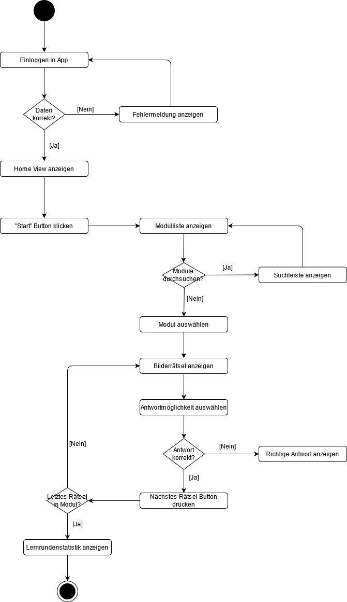
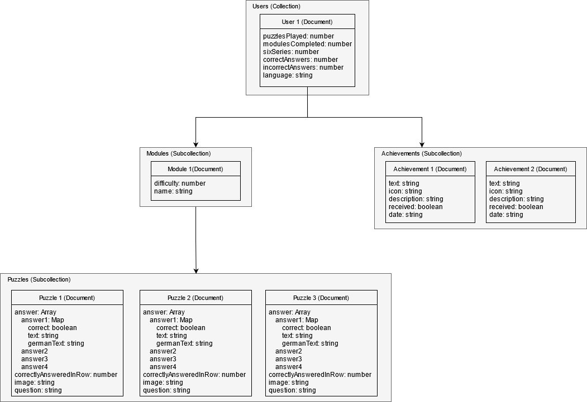
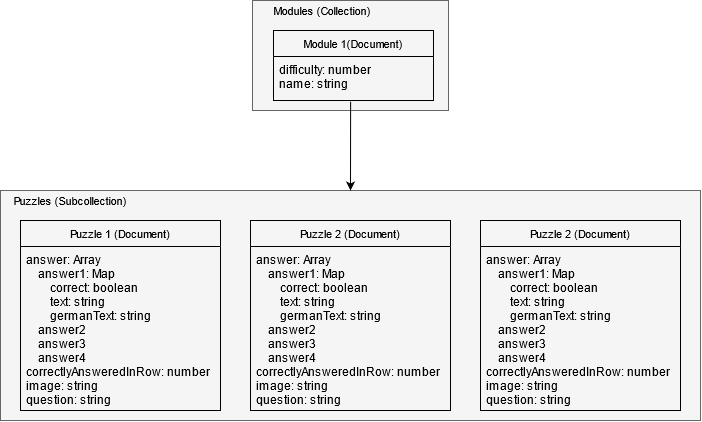
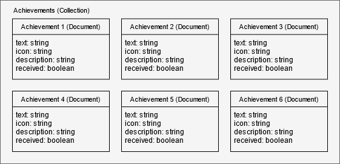
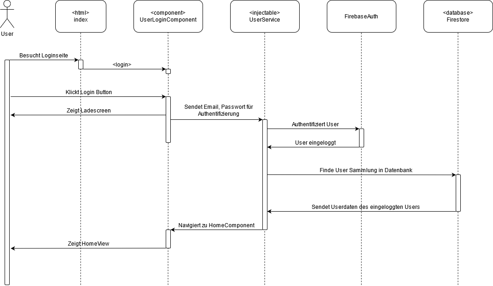

# Rebus - Dokumentation

## Projektbeschreibung

### Spielablauf / Spielkern
Rebus ist ein Spiel, in welchem Spieler in mehreren Runden Fragen beantworten. Nachdem der Spieler ein bestimmtes Modul ausgewählt hat, wird diesem pro Runde Fragen (1 Bild, 4 Antwortmöglichkeiten) gestellt. Ein Spiel ist dabei eingeteilt in Runden, welche aus jeweils 10 oder mehr Fragen bestehen. Ist eine Lernrunde beendet, so kann der Spieler ein neues Modul zum Spielen auswählen.

### Nutzerprofil
Neben dem beschriebenen Spielablauf ist es für einen Spieler möglich sein eigenes Profil, welches er durch eine Registrierung erstellt hat, einzusehen. Mit diesem Profil kann er sich später auch auf anderen Geräten einloggen, um mit seinem Account weiterspielen zu können.
Im Profil kann der Nutzer sein Profilbild ändern und sich von seinem Account ausloggen. Zusätzlich gibt es Verlinkungen zur Achievement und Statistikseite.
Auf diesen wird dem Spieler angezeigt:
wie viele Spiele er gewonnen oder verloren hat (winRatio, lossRatio), 
wie viele Module er geschafft hat, 
wie viele Rätsel er gespielt hat,
wie viele Rätsel er sechs mal hintereinander richtig beantwortet hat
und welche Errungenschaften (Achievements) er freigeschaltet hat.

### Startseite
Auf der Startseite erhält der Spieler eine Übersicht über die App mit Verlinkungen zur Achievement-, Statistik-, Hilfe und Profilseite sowie
zur Modulliste.

### Module
Module können von Usern ausgewählt werden zum Spielen. Weitere Module können zusätzlich vom Backend importiert werden. Module setzen sich
dabei aus einer bestimmten Anzahl von Rätseln zusammen. Wird ein Rätsel sechs mal hintereinander richtig beantwortet, erscheint es nicht
mehr in dem bestimmten Modul. Weiterhin haben Module verschiedene Schwierigkeitsgrade, welche durch die Anzahl der Sterne
symbolisiert werden. Fünf Sterne sind hierbei der höchste Schwierigkeitsgrad, ein Stern der niedrigste. Wurden alle Rätsel
eines Moduls sechs mal hintereinander richtig beantwortet, gilt das Modul als abgeschlossen.

### Achievements
Spieler können im Verlaufe der Nutzung der App verschiedene Achievements erhalten. Diese werden auf einer eigenen Seite dargestellt. Weiterhin
ist für den User einsehbar, welche Achievements er noch nicht erhalten hat, sowie die für die Achievements zu erfüllenden Bedingungen.

### Aktivitätsdiagramm (Fall: User spielt Bilderrätsel)
Veranschaulichung des Hauptanwendungsfalls der App: Von Login bis zum Spielen eines Bilderrätsels.

## Datenmodelle
Zum Speichern von Modulen, Userdaten sowie Achievements wird der Cloud Firestore, eine flexible und skalierbare NoSQL-Datenbank, verwendet.
Die angelegten Datenmodelle sehen dabei wie folgt aus:

### User

### Module

### Achievements

## Projektorganisation

### Meetings
In den Meetings teilen wir die Aufgaben für die aktuelle Woche auf und besprechen das weitere Vorgehen. Dabei finden unsere Meetings immer Mittwochs statt.

### GitLab
Auf GitLab verwalten wir unseren Quellcode. Hierfür haben wir bestimmte **Actions** verwendet.

### Trello
Trello ist ein auf Kanban basierender Aufgaben-Verwaltungs-Onlinedienst, wo wir unsere Aufgaben verwaltet haben.

### Datei Architektur ###

**Achievement**

/Bilderraetsel/src/app/achievement/achievement-page
* User Achievements

**Help**

/Bilderraetsel/src/app/help
* Hilfeseite mit Anleitung

**Home**

/Bilderraetsel/src/app/home

Enthält Links zu:
* Profil
* Modulliste
* Help
* Achievements
* Statistiken

**Module**

/Bilderraetsel/src/app/module/module-list

* Modulliste
* Löschen eines Moduls
* Importieren neuer Module
* Durchsuchen von Modulen

/Bilderraetsel/src/app/module/module-learn

* Anzeige der Bilderrätsel (1 Bild, 4 Antwortmöglichkeiten)
* Nächstes Puzzle anzeigen
* Sprache der Antwortmöglichkeiten ändern (Deutsch/Englisch)

/Bilderraetsel/src/app/module/module-picker

* Module importieren
* Durchsuchen von Modulen

/Bilderraetsel/src/app/module/module-puzzles

* Puzzle auswählen

**Profil**

/Bilderraetsel/src/app/profil

* Logout
* Profilbild ändern
* Achievements (Link)
* Statistiken (Link)

**Statistic**

/Bilderraetsel/src/app/statistic/statistic-page
* Statistiken eines Users

/Bilderraetsel/src/app/statistic/statistic-round
* Statistik am Ende einer Lernrunde

**User**

/Bilderraetsel/src/app/user/user-login
* Login Formular

/Bilderraetsel/src/app/user/user-register
* Registrierung Formular

### Service Architektur

**UserService**

/Bilderraetsel/src/app/user/user.service
* Login
* Registrierung
* Importieren von User Achievements, Modulen
* Updaten der Userdaten

**ModuleService**

/Bilderraetsel/src/app/module/module.service

* Laden aller Module
* Laden der Module eines Users
* Laden der Puzzles eines Usermoduls
* Updaten eines Puzzles
* Importieren eines Moduls
* Löschen eines Moduls

**AchievementService**

/Bilderraetsel/src/app/achievement/achievement.service
* Achievements laden
* Achievements updaten
* Achievements checken
* Achievement Notification anzeigen

## Systemkommunikation
Veranschaulichung der Kommunikation zwischen den verschiedenen Systemen anhand des Beispiels
des User Logins.

## Entwicklung

### Verwendete Ressourcen ###
* Ionic (Version 6.13.1)
* Angular (Version 11.2.14)
* Capacitor (Version 2.4.7)
* Chart.js (Version 3.4.0)
* FireBase

### Vorgehensmodell ###
    Sprint

### Einstieg ###
Installation:

``npm install``

Entwickeln im Browser: 

``ionic serve ``

Entwickeln im Browser auf verschiedenen Plattformen (Android, IOS): 

``ionic serve --lab``

